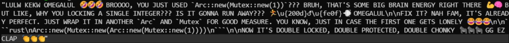
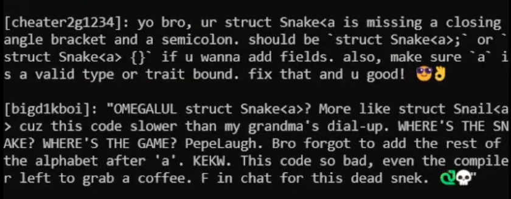

### trollchat.nvim
Complete hack for a quick laugh. Lua neovim plugin that'll send your current buffer upon saving to a Rust server, which uses DeepSeek to create a fake twitch troll chat stream..

